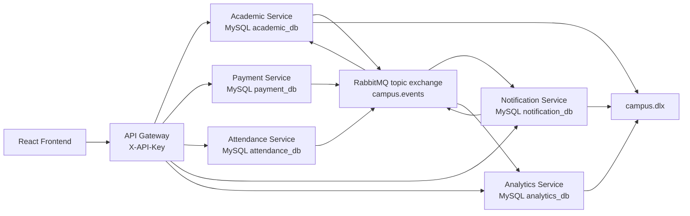

# Documento de arquitectura

## Problema

La red de colegios registra estudiantes, matriculas, pagos, asistencia,
notificaciones e indicadores en sistemas separados. CampusConnect 360 integra esos
flujos para reducir duplicidad, retrasos operativos y falta de trazabilidad.

## Alcance

La solucion cubre los flujos obligatorios de la consigna:

- Registro de estudiante y matricula.
- Confirmacion de pago y actualizacion financiera.
- Registro de asistencia e incidentes.
- Notificaciones simuladas.
- Dashboard directivo alimentado por eventos.
- Escenario de falla controlada con DLQ.

## Actores

- Secretaria Academica.
- Finanzas.
- Docente o Bienestar.
- Representante, simulado como destinatario de notificaciones.
- Direccion, mediante dashboard.

## Diagrama de arquitectura



## Flujo de eventos

1. Academic publica `StudentEnrolled`.
2. Notification consume el evento y guarda una notificacion simulada.
3. Analytics consume el evento y actualiza matriculados/eventos procesados.
4. Payment publica `PaymentCreated` y luego `PaymentConfirmed`.
5. Academic consume `PaymentConfirmed`, marca al estudiante como `PAID` y publica
   `StudentStatusUpdated`.
6. Attendance publica `AttendanceRecorded` o `IncidentReported`.
7. Notification y Analytics reaccionan a esos eventos.
8. Si Notification falla de forma controlada, publica `NotificationFailed` y el
   mensaje original se envia a `notification.dead-letter`.

## APIs principales

- Academic: `/api/academic/students`, `/api/academic/enrollments`,
  `/api/academic/students/{studentCode}/events`.
- Payment: `/api/payments`, `/api/payments/{paymentCode}/confirm`.
- Attendance: `/api/attendance/records`, `/api/attendance/incidents`,
  `/api/attendance/students/{studentCode}/history`.
- Notification: `/api/notifications`, `/api/notifications/simulate-failure`.
- Analytics: `/api/analytics/dashboard`, `/api/analytics/events`.

Cada servicio expone Swagger en `http://localhost:{puerto}/swagger-ui.html`.

## Patrones de integracion

- API Gateway: Spring Cloud Gateway centraliza `/api/**`.
- Publish/Subscribe: Notification y Analytics consumen eventos de negocio.
- Point-to-Point: Academic consume `payment.confirmed` en su cola propia.
- Message Channel: colas `academic.payment-confirmed`,
  `notification.business-events` y `analytics.business-events`.
- Event Message: todos los eventos tienen `eventId`, `eventType`, `occurredAt`,
  `correlationId`, `entityId` y `data`.
- Message Translator: Notification transforma eventos de negocio en mensajes
  para representantes.
- Idempotent Receiver: Analytics y Notification evitan reprocesar `eventId`;
  Academic evita duplicar actualizaciones financieras.
- Dead Letter Channel: `campus.dlx` y colas `*.dead-letter`.
- CQRS: Analytics mantiene un snapshot de lectura para el dashboard.
- Health Check API: Actuator `/actuator/health` en gateway y servicios.
- Logs/trazabilidad: `correlationId` y tablas de eventos por estudiante y analitica.

## Seguridad

El gateway exige el header `X-API-Key` en todas las rutas `/api/**`. El valor se
configura con `CAMPUS_API_KEY` y por defecto es `campus-demo-key`.

## Resiliencia

Notification Service tiene un endpoint para activar una falla controlada:

```http
POST /api/notifications/simulate-failure
X-API-Key: campus-demo-key
```

El siguiente evento consumido se registra como `NotificationFailed`, se publica el
evento de falla y el mensaje original se envia a la DLQ por `AmqpRejectAndDontRequeueException`.

## Observabilidad

- Actuator health por servicio.
- RabbitMQ Management para inspeccionar colas, exchanges y DLQ.
- Analytics Event Log para revisar `eventId`, `eventType`, `correlationId` y resumen.
- Academic Student Event Log para revisar eventos por estudiante.

## Integracion de datos y dashboard

Analytics Service funciona como proyeccion CQRS/ELT ligera: consume eventos desde
RabbitMQ, aplica idempotencia por `sourceEventId`, actualiza `analytics_snapshots`
y guarda los ultimos eventos en `analytics_events`.

## Decisiones tecnicas

- Un solo frontend React con modulos por rol para mantener una demo simple.
- MySQL separado por servicio para respetar propiedad de datos.
- RabbitMQ topic exchange para permitir nuevas suscripciones sin cambiar productores.
- API key en gateway en lugar de login completo para cumplir seguridad basica sin
  bloquear la demo.
- `ddl-auto: update` para facilitar ejecucion academica con Docker Compose.

## Limitaciones conocidas

- No hay autenticacion por usuario final ni RBAC granular.
- No se implemento reintento manual desde DLQ.
- Las notificaciones son simuladas y no se envian por correo real.
- El dashboard depende de eventos nuevos; datos creados manualmente en bases no se
  reflejan si no pasan por los servicios.

## Mejoras futuras

- JWT con roles por portal.
- Outbox pattern para publicar eventos despues de commit de base de datos.
- Reprocesamiento controlado de DLQ desde UI administrativa.
- Observabilidad con Prometheus/Grafana.
- Pruebas de integracion con Testcontainers.

## Uso de IA y recursos externos

Se uso asistencia de IA para acelerar implementacion de frontend, documentacion,
estructura de eventos y pruebas de consistencia. El equipo debe revisar, ejecutar y
defender cada componente durante la presentacion.
